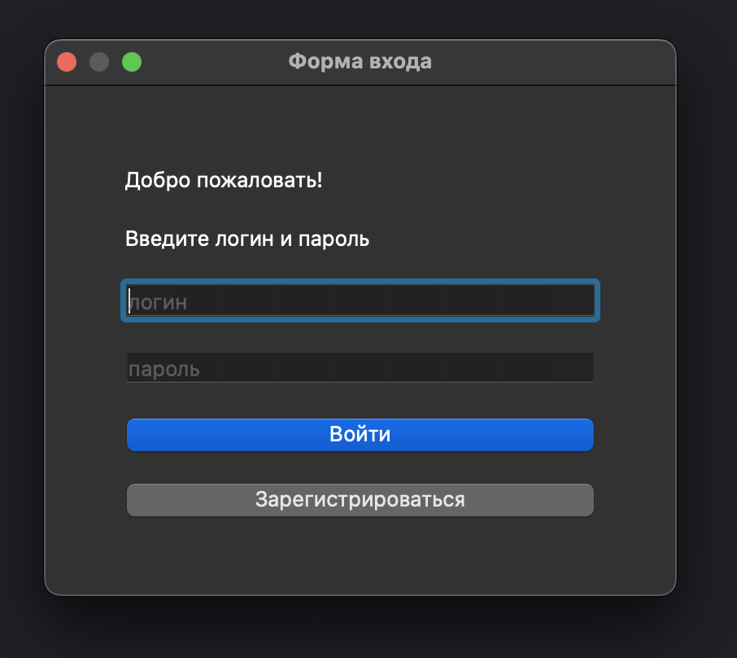
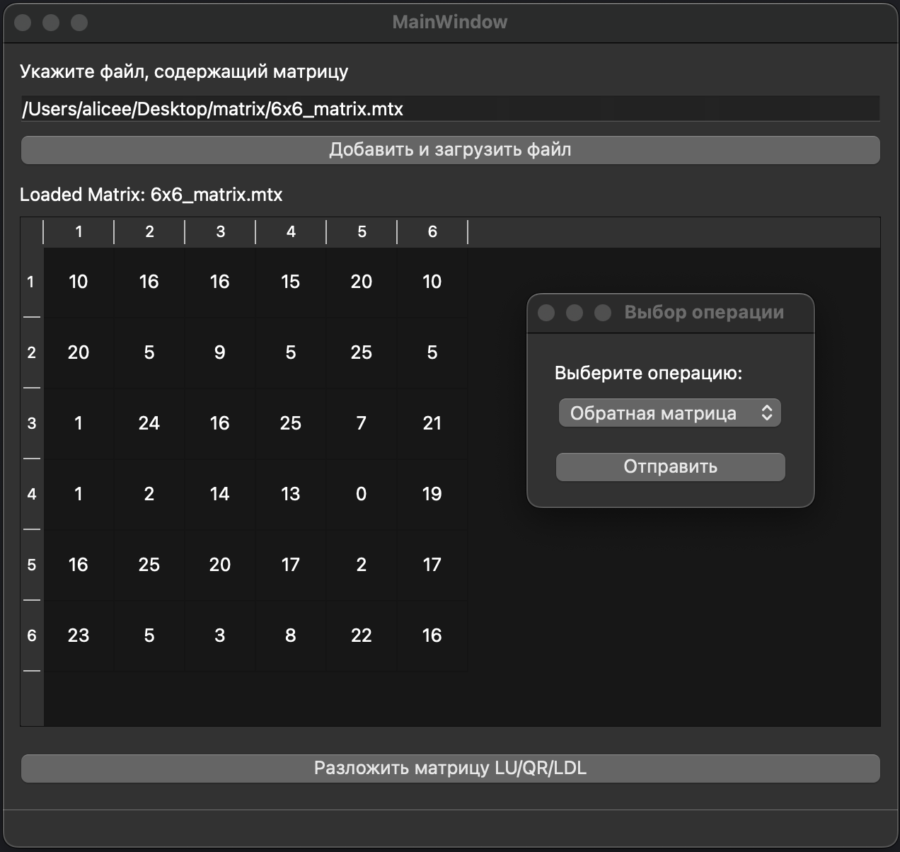
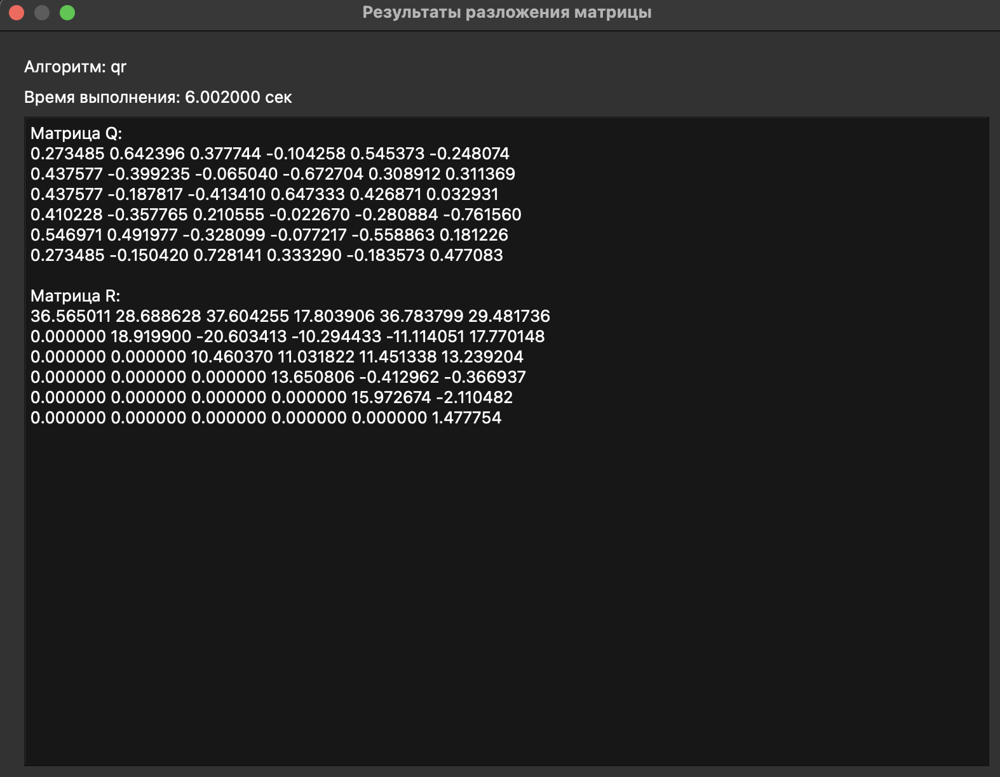
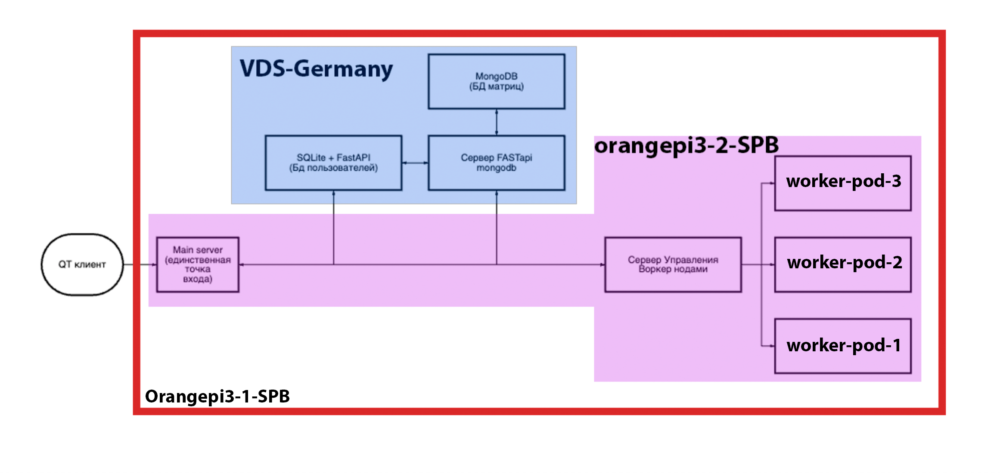
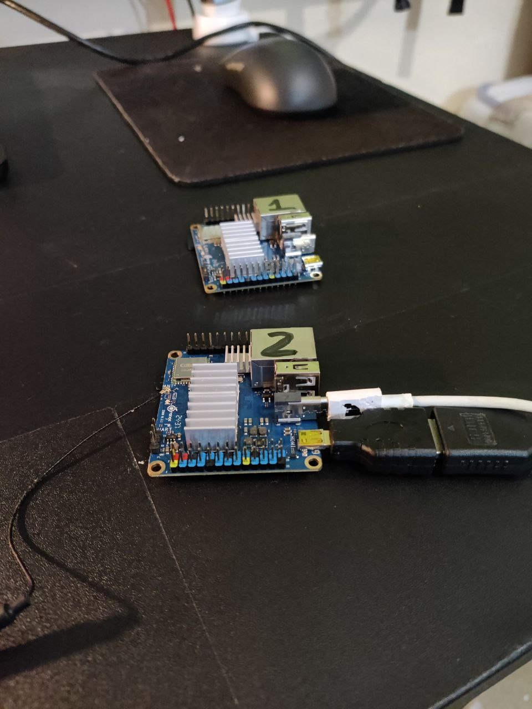
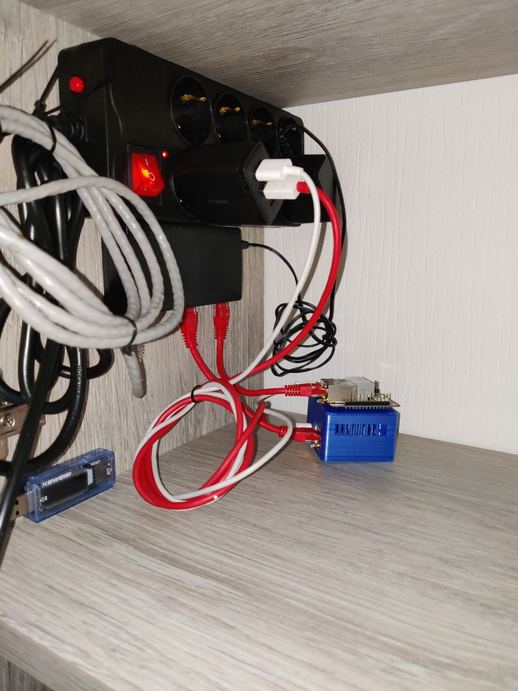

# 🧮 Distributed Matrix Computation System

## 🌟 Overview
This project is a 🐾 pet project designed to perform **📤 distributed computations of matrix operations** such as:
- ✂️ QR decomposition
- 📐 LU decomposition
- 🔄 LDL decomposition
- 🔃 Inverse matrix calculation

The system consists of two main 🧩 components:
1. **🖥️ Qt-based client application**: A 🖱️ graphical interface for user interaction.
2. **☁️ K3s-based cluster**: A distributed computational 🔙 backend deployed across 🖨️ three physical devices.

---

## 🎛️ Key Features

### 🖥️ Qt Client Application
The Qt application provides the following ⚙️ functionality:
- **👤 User Management**: Registration and 🔑 login using 📧 email or username.
- **🧮 Matrix Management**:
  - 📂 Upload matrix files in `.mtx` format to the 🖥️ server.
  - 🖼️ Display uploaded matrices in the UI.
- **📊 Operation Selection and Execution**:
  - 📩 Send selected matrix operations (✂️ QR, 📐 LU, 🔄 LDL, 🔃 inverse) to the ☁️ cluster.
  - 📤 Receive and display computation 📝 results.

The application is built using **🌐 QNetworkAccessManager** to interact with the 🛠️ backend REST API.



---

### ☁️ K3s Cluster Architecture

The cluster consists of multiple 🛖 pods orchestrated by K3s and spans 🌐 three devices:
- **2 🍊 Orange Pi Zero 3 boards** (LAN-connected with 🌍 public IPs).
- **1 Virtual Dedicated Server (VDS)** in 🇩🇪 Germany.

The cluster’s **👑 master node** runs on one of the 🍊 Orange Pi Zero 3 boards and orchestrates the deployment and recovery of 🐳 Docker containers. Below is a detailed 🗺️ breakdown of the cluster’s components:





#### 🏗️ Main Pod
- Acts as the **🚪 single entry point** for all client 📨 requests.
- Handles:
  - 🔀 Forwarding client requests to appropriate 🛖 pods.
  - ✅ Validating responses from other 🛖 pods.
- Communication: HTTP-based 🌐 REST API.

#### 📒 SQLite Pod
- Stores user 🧑‍💻 data (`users.db`): 🔑 login, 🔒 password, 📧 email, and name.
- Built with **🐍 Python**, **⚡ FastAPI**, and **📒 SQLite**.
- Synchronizes with 🍃 MongoDB using HTTP 📨 requests.

#### 🍃 Mongo Control Pod & 🍃 MongoDB Container
- **🍃 MongoDB Container**:
  - Uses 📦 GridFS to store matrices in 🧩 chunks.
- **🍃 Mongo Control Pod**:
  - Provides HTTP 🌐 endpoints for matrix management (📤 upload, 📥 retrieve, 📃 list).
  - Features 🧮 deduplication using 🧮 hash functions to avoid redundant 🗃️ storage.
  - Built with **🐍 Python**, **⚡ FastAPI**, and **🌐 HTTPx**.

#### ⚙️ Worker Node Controller Pod
- Distributes 🧮 matrix computation tasks to ⚙️ worker pods.
- Responsibilities:
  - Converts `.mtx` 📂 files to `numpy` arrays.
  - Queries ⚙️ worker pod status (using **📊 psutil**) to identify the least loaded pod.
  - Requests matrix 🗂️ data from 🍃 MongoDB.

#### ⚙️ Worker Pods
- Perform actual 🧮 matrix computations (✂️ QR, 📐 LU, 🔄 LDL, 🔃 inverse).
- Execution:
  - 🔄 Asynchronous processing via 🐍 Python threads.
  - 📝 Results are fetched by the ⚙️ Worker Node Controller Pod.
- Typically, 3 ⚙️ worker pods are active, but the system can 📈 scale horizontally by adding more ⚙️ pods.

---

## ⚙️ Installation

### 🛠️ Prerequisites
- **🐳 Docker**
- **☁️ K3s**
- **🖥️ Qt Development Environment**

### 🚀 Deploying the Cluster
1. Clone the 🗂️ repository:
   ```bash
   git clone <repository-url>
   cd docker_servers
   ```
2. 🏗️ Build and push Docker 🐳 images:
   ```bash
   ./push_all_images_to_docker_hub.sh
   ```
3. Apply Kubernetes YAML 🗒️ configurations:
   ```bash
   kubectl apply -f yaml_files_for_k8s/
   ```

### ▶️ Running the Qt Client
1. Navigate to the `qt` 🗂️ directory:
   ```bash
   cd qt
   ```
2. 🛠️ Build the application:
   ```bash
   mkdir build && cd build
   cmake .. && make
   ```
3. ▶️ Run the client:
   ```bash
   ./DB_client
   ```

---

## 🧪 Testing

### ☁️ Cluster Testing
Each 🛖 pod and the ☁️ cluster as a whole are tested using `test.sh` scripts, which use `curl` to perform 🔁 end-to-end tests.
1. Navigate to the pod’s 🧪 test directory, e.g., `main_server/tests/`.
2. Run the test 🛠️ script:
   ```bash
   ./tests.sh
   ```

### 🧮 Sample Test Data
The 🗂️ repository includes multiple `.mtx` 📂 files in the `tests/` directories for testing matrix computations, ranging from 🟦 small matrices to 🟥 large ones (up to 🗂️ 257 MB).

---

## 🗂️ Directory Structure
```plaintext
.
├── 🐳 docker_servers
│   ├── 🛠️ configs
│   ├── 🍃 db_mongo
│   ├── 📒 db_sqlite
│   ├── 🐳 docker-compose.yml
│   ├── 🏗️ main_server
│   ├── 🍃 mongo_app
│   ├── 📒 sqlite_app
│   ├── ⚙️ worker_node
│   ├── ⚙️ worker_node_control_server
│   └── 🗒️ yaml_files_for_k8s
├── 🖥️ qt
│   ├── ✂️ calculation_matrix_form.cpp
│   ├── ⬇️ download_files_form.cpp
│   ├── 🔑 login_form.cpp
│   └── ...
└── 📽️ presentation.pptx
```

---

## ⚠️ Known Limitations
- Currently supports only `.mtx` 📂 file format.
- Requires manual 📈 scaling of ⚙️ worker pods for large-scale 🔁 operations.

---

## 🛠️ Future Plans
- ➕ Add support for additional 🧮 matrix formats.
- 🤖 Automate ⚙️ worker pod scaling based on 📊 load.
- 🛠️ Introduce advanced 📈 logging and 🕵️ monitoring tools for the ☁️ cluster.

---

## 📝 License
This project is 🆓 open-source and licensed under the 🅼🅸🆃 License.

